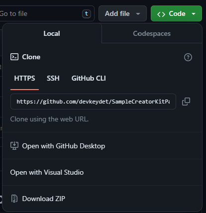

# Sample Dataverse Solution showcasing using cdsproj as the driver of fusion development

Fusion development is a term often used to describe bringing together low code and code first (aka pro code) technologies together when developing applications. The [Microsoft Power Platform](https://learn.microsoft.com/power-platform/) has both low code and code first extensibility.  You can learn more about code first extensibility using the [Microsoft Power Platform developer documentation](https://learn.microsoft.com/power-platform/developer/).  The mechanism for implementing Application Lifecycle Management (ALM) in Power Platform is called a [Solution](https://learn.microsoft.com/power-platform/alm/solution-concepts-alm). While fusion development is an often overloaded term, the sample Solution in this repo aims to share a Hello World example of fusion development grounded in source control being the source of truth.  The source code was produced using the [Power Platform CLI](https://learn.microsoft.com/power-platform/developer/cli/introduction).  In source control based ALM, the build process is what typically builds the source code into a deployable artifact.  In Power Platform ALM, the Solution is the deployable artifact.  The Power Platform CLI has a number of commands through [pac solution](https://learn.microsoft.com/power-platform/developer/cli/reference/solution) that enable source control based ALM for solutions through the `*.cdsproj` file.  When using a `*.cdsproj` to drive the building of a Solution, you can achieve the "fusing" of low code and code first elements of your Solution by simply running `dotnet build`.

## This sample contains the following

* Low code
  * Canvas app
  * Model driven app
  * Dataverse Table Table
* Code first
  * PCF Component written using TypeScript and React
  * Dataverse plugin written using C#
  * JavaScript web resource written using TypeScript

## Getting started

To understand how this sample was created, you can watch this end to end walkthrough.

[TODO: INSERT VIDEO ONCE RECORDED]

To build the Solution, you can do the following.  Since this Solution usings .NET Framework 4.6.2 for the Dataverse plugin assembly, this works on Windows only.

1. Install [Power Platform CLI](https://learn.microsoft.com/power-platform/developer/cli/introduction?tabs=windows#install-microsoft-power-platform-cli) & [.NET SDK](https://dotnet.microsoft.com/en-us/download).
1. Clone the repo or download the zip

    

1. After acquirig the code

    ```
    cd HelloFusionDev
    cd webresource-src
    npm install
    cd ..
    dotnet build
    ```

In the `bin/debug` directory, you will have managed and unmanaged versions of the Solution.  The web resource in the Solution will not be minified and will have source maps.  If you run `dotnet build -c release`, the Solutions will have optmized web resources.

Thanks to [@scottdurow](https://twitter.com/scottdurow) for his awesome (free) course [Building JavaScript Web Resources using TypeScript](https://learn.develop1.net/courses/building-javascript-web-resources-using-typescript/dashboard) for the inspiration.
